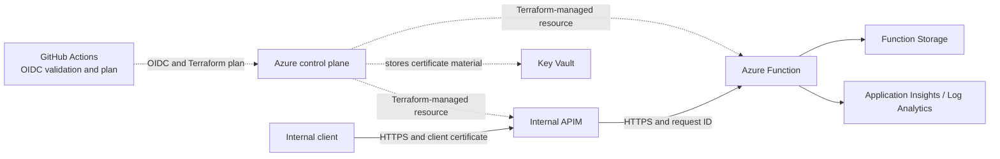

# Azure Internal API Platform Assessment

## Overview

Terraform deploys an internal Azure API using API Management (APIM) and a Python Azure Function.

The request path is:

1. An internal client sends a request to APIM.
2. APIM checks the client certificate.
3. APIM preserves or creates an `x-request-id`.
4. APIM forwards the request to the Function.
5. The Function validates the message and returns JSON.

The deployment also includes private DNS, Function Storage, Key Vault, Application Insights, Log Analytics, a memory alert, and GitHub Actions authentication through OIDC.

## Architecture



## Key design choices

- APIM Developer supports internal VNet mode.
- Function access is restricted to the APIM subnet.
- Private DNS resolves the internal APIM hostname.
- Request IDs pass through APIM, the Function, logs, and responses.
- Key Vault stores certificate material, while Application Insights and Log Analytics collect telemetry.

## Prerequisites and configuration

Required:

- An Azure subscription and existing resource group
- Azure CLI
- Terraform `>= 1.7.0`
- Python 3.11
- Azure Functions Core Tools v4
- Git
- Access to the VNet for API testing
- Azure permissions to manage resources, role assignments, and Key Vault certificates

Create the local variables file:

```powershell
Copy-Item .\terraform\terraform.tfvars.example .\terraform\terraform.tfvars
```

Required Terraform variables:

| Variable | Purpose |
| --- | --- |
| `subscription_id` | Target Azure subscription |
| `resource_group_name` | Existing resource group |
| `location` | Azure region |
| `project_name` | Resource naming prefix |
| `environment` | `dev` or `prod` |
| `apim_publisher_email` | APIM publisher email |

Example:

```hcl
subscription_id      = "00000000-0000-0000-0000-000000000000"
resource_group_name  = "rg-example-dev"
location             = "uksouth"
project_name         = "checkout-assessment"
environment          = "dev"
apim_publisher_email = "platform@example.com"
```

See `terraform/variables.tf` for defaults and validation. `terraform.tfvars` is ignored by Git.

## Deployment

From the repository root:

```powershell
az login
az account set --subscription "<subscription-id>"

Set-Location .\terraform
terraform init
terraform fmt -check -recursive
terraform validate
terraform plan -var-file="terraform.tfvars" -input=false -out="assessment.tfplan"
terraform apply "assessment.tfplan"
```

Publish the Function from the repository root:

```powershell
Set-Location .\src\function\ProcessMessage
$functionAppName = terraform -chdir="..\..\..\terraform" output -raw function_app_name
func azure functionapp publish $functionAppName --python
```

## API usage

The certificate and private-key paths are placeholders for temporary test files. They are not stored in the repository.

Run the request from a machine inside the VNet.

```powershell
$apiUrl = terraform -chdir=".\terraform" output -raw apim_process_message_url

curl.exe `
  --request POST `
  --url $apiUrl `
  --header "Content-Type: application/json" `
  --header "x-request-id: example-request-001" `
  --cert ".\client-certificate.pem" `
  --key ".\client-private-key.pem" `
  --data '{"message":"hello"}'
```

Request:

```json
{
  "message": "hello"
}
```

Response:

```json
{
  "message": "hello",
  "timestamp": "2026-07-21T20:00:00.000000+00:00",
  "requestId": "example-request-001"
}
```

APIM preserves a supplied `x-request-id` or creates one. The Function returns it in the response body and header.

Empty, invalid, missing, non-string, or blank messages return HTTP 400. Unexpected errors return a generic HTTP 500 response.

## Security and mTLS

APIM runs in internal VNet mode. The Function denies direct access and allows requests from the APIM subnet.

APIM currently accepts one Terraform-generated self-signed certificate by exact SHA-1 thumbprint. Missing and different certificates are rejected, so this works for one approved client.

The assessment specifies a self-signed CA and a separate client certificate signed by that CA. The submitted implementation uses leaf-certificate pinning instead, so CA-based trust remains the main certificate-design gap.

## Runtime validation

The following tests were run from temporary infrastructure inside the VNet:

| Test | Result |
| --- | --- |
| Private DNS | `checkout-assessment-dev-apim.azure-api.net` resolved to `10.10.3.4`. |
| No certificate | HTTP 401 Unauthorized: `Client certificate missing.` |
| Wrong certificate | HTTP 401 Unauthorized: `Invalid client certificate.` |
| Approved certificate | HTTP 200 OK. |
| Request ID | `mtls-trusted-test-001` was preserved and returned by the Function. |
| Direct Function request | HTTP 403 `Ip Forbidden`. |

## Observability

- Application Insights is connected to the Function.
- Application Insights uses the Log Analytics workspace.
- Function logs include the request ID.
- Azure Monitor checks the Function's average memory use.

Function telemetry covers requests that reach the backend. Requests rejected by APIM before backend execution are not currently included in the demonstrated central audit trail.

## CI/CD and OIDC

The GitHub Actions workflow runs Terraform format, validation, and plan checks. It uses OIDC to sign in to Azure and does not run `terraform apply`.

See [GitHub Actions OIDC setup](docs/oidc-setup.md).

Because the assessment uses local Terraform state, the hosted CI plan validates configuration but does not compare against the workstation's deployed state.

## Remote state

Local Terraform state was used for this assessment. A shared setup would use Azure Blob Storage, authenticate through OIDC and Microsoft Entra ID, and use Blob leases for state locking.

## Known differences and next steps

| Area | Current position | Intended improvement |
| --- | --- | --- |
| Certificate trust model | APIM checks one self-signed certificate by thumbprint. | Use a CA and a separate CA-signed client certificate. |
| Storage private networking | Function Storage uses its authenticated Azure public service endpoint. | Add private endpoints, private DNS, and deny-by-default rules. |
| APIM rejected-request logging | Function logs cover requests that reach the backend. | Add APIM request logging for rejected requests. |
| Local Terraform state | CI cannot compare with the deployed local state. | Store shared state in Azure Blob Storage. |

## Costs

These figures are illustrative GBP estimates for a low-traffic development deployment in UK South and should be checked against the Azure Pricing Calculator:

| Service | Monthly range (GBP) |
| --- | ---: |
| APIM Developer | £35-£55 |
| Function Flex Consumption | £0-£8 |
| Storage | £1-£4 |
| Key Vault | £1-£4 |
| Application Insights / Log Analytics | £0-£12 |
| Private endpoint / DNS | £6-£12 |
| **Total** | **£43-£95** |

APIM is the main fixed cost. Prices vary by usage, region, billing agreement and exchange rate.

## Teardown

From `terraform/`:

```powershell
terraform plan -destroy -var-file="terraform.tfvars" -input=false
terraform destroy -var-file="terraform.tfvars"
```

Terraform does not delete the existing resource group. Remove temporary certificate files and GitHub OIDC credentials when they are no longer needed.

## AI usage

AI helped with Terraform authoring, integration, troubleshooting, testing, auditing and documentation. Suggestions were reviewed using Terraform validation and plans, observed Azure behaviour, runtime tests and a final check against the assessment requirements. See [AI usage and technical critique](docs/ai-usage-and-critique.md).
